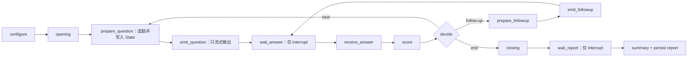

# AI 模拟面试官系统：完成度评估与后续优化建议

> 评估日期：2026-08-09
> 评估对象：`DEMO3/TOtal` 当前工作区
> 评估方式：代码静态审阅、目录与配置核验、Python 语法检查、前端生产构建、Docker Compose 配置检查、题库与 Chroma 数据核对
> 说明：本文是新增评估文档，不代表已经实施下述修复。

## 1. 执行摘要

项目已从“多版本、手工状态机、功能分散”的原型，推进到结构清晰的全栈演示系统。LangGraph 编排骨架、8 岗位题库、混合检索、报告 API、雷达图、模型分层、Docker 文件和项目说明均已落地，前端可以完成生产构建，题库文件与现有 Chroma 集合也都包含 86 道题。

综合判断：

- **构件到位率约 84%**：规划中的主要文件、模块和界面基本存在。
- **按可运行闭环加权的总体完成度约 71%**：核心链路仍有会影响正确性的 LangGraph `interrupt()` 恢复问题，生产静态托管也未真正闭环。
- **答辩演示就绪度约 68%**：完成 P0 修复并跑通固定验收脚本后，可提升到 85% 以上。
- **生产就绪度约 40%**：身份认证、数据隔离、持久化、测试、CI、可观测性和部署可靠性尚未达到生产标准。

当前项目适合定位为：**架构升级已基本成形、功能较完整，但仍需一次“稳定性与交付闭环冲刺”的可演示工程原型**。不建议在修复 P0 问题前宣称“全链路稳定完成”或“可直接生产部署”。

## 2. 评估边界与验证结果

### 2.1 已执行检查

| 检查项 | 结果 | 结论 |
|---|---:|---|
| Python 源码语法解析 | 22 个 `.py` 文件全部通过 | 未发现语法错误 |
| Vue 生产构建 | Vite 成功转换 635 个模块并输出产物 | 前端源码可构建 |
| Docker Compose 配置 | `docker compose config --quiet` 通过 | 编排文件语法有效；`version` 字段已过时但不阻塞 |
| 题库文件 | 8 个岗位、86 组 Q/A/S、86 个唯一 ID | 题库数量和唯一性符合说明 |
| Chroma 集合 | `interview_questions` 当前记录数为 86 | 当前本地向量库已包含全部题目 |
| 后端端到端运行 | 未完成 | 当前可用 Python 环境缺少 `langchain`，且未使用真实 LLM Key 启动完整链路 |
| Docker 镜像构建与容器实跑 | 未完成 | 本次只做配置检查，未下载依赖或构建大模型相关镜像 |
| 自动化测试 | 未发现测试目录或测试配置 | 目前没有可重复的回归证据 |

### 2.2 结论可信度说明

本文对“文件是否存在、代码是否接通、静态逻辑是否正确、前端是否可构建、题库是否完整”的判断置信度较高；对真实 LLM 响应质量、首字延迟、并发能力、容器冷启动时间等运行指标，只能标为待实测，不能以 README 中的描述替代验收结果。

## 3. 分阶段完成度

完成度按“实现存在、链路接通、可验证、可交付”四个维度综合估算，并对核心编排阶段赋予更高权重。

| 阶段 | 权重 | 评估完成度 | 状态 | 主要依据 |
|---|---:|---:|---|---|
| 阶段 0：基线清理与修复 | 15% | **88%** | 基本完成 | 公共函数下沉、配置统一、循环依赖解除、CORS 收敛、旧目录归档规则已落地 |
| 阶段 1：LangGraph 核心迁移 | 30% | **62%** | 结构完成，运行语义待修 | 9 节点 StateGraph、条件边、checkpointer、WebSocket 驱动均存在；但中断恢复存在正确性风险 |
| 阶段 2：功能增强 | 25% | **76%** | 主要功能存在，闭环不完整 | 8 岗位 86 题、报告 API、雷达 JSON、ECharts 页面已实现；会话续接和报告归属仍不完整 |
| 阶段 3：性能与提示词 | 15% | **80%** | 代码措施已落地，缺实测 | fast/strong 模型入口、答案缓存、JSON 提示约束已实现；缺基准数据，部分配置未生效 |
| 阶段 4：工程化与文档 | 15% | **55%** | 部分完成 | README、方案、Docker 文件、前端构建均存在；单服务静态托管、测试、CI、健康检查尚未闭环 |
| **加权总计** | **100%** | **约 71%** | **需稳定性冲刺** | 核心正确性和部署闭环拉低总体完成度 |

### 3.1 阶段 0 评价

已完成的部分：

- `common.py` 集中了承担岗位匹配、难度映射、技能提取、JSON 提取的公共逻辑。
- `retrieval/embeddings.py` 解除了 retrieval 对 agent 的反向依赖。
- LLM Key、模型名、CORS、模型路径等配置已集中到 `config.py` 与 `.env.example`。
- 根目录已增加 `_archive/` 和运行产物忽略规则。
- 多处静默异常已改为日志输出。

仍有差距：

- `server.py` 的报告列表和 WebSocket 清理中仍存在 `except: pass`，会掩盖坏报告或发送失败原因。
- `.trae-html-share-packages/`、`.zcode/` 等本地目录仍处于未跟踪状态，仓库清理规则还不完整。
- `EMBEDDING_ONLINE` 已写入配置和示例环境变量，但 `retrieval/embeddings.py` 未读取它，当前仍只会实例化 HuggingFace Embeddings。
- README 的目录说明仍只列出早期 5 岗位，与实际 8 岗位不一致。

### 3.2 阶段 1 评价

结构层面已经明显进步：状态集中在 `InterviewState`，编排从服务端大段 `if/elif` 迁移为 9 个节点和条件边，服务端只负责把 WebSocket 消息映射为图输入并转发流事件。这一方向正确，也更适合答辩展示。

但当前 `ask_node`、`followup_node`、`closing_node` 都在执行随机选题、LLM 流式输出或结束事件后才调用 `interrupt()`。LangGraph 恢复时会从包含中断的节点开头重新执行，因此中断前逻辑会再次运行。该行为也见 [LangGraph 官方 Interrupts 文档](https://docs.langchain.com/oss/python/langgraph/interrupts)。

具体影响：

- 用户回答后，`ask_node` 会再次随机选择话题和分类、再次检索并再次输出题目。
- 由于选题辅助函数使用 `random.sample()` 和 `random.choice()`，恢复时选中的题目可能变化。
- 用户实际看到并回答的题目，可能与恢复后写入 `current_question`、随后用于取标准答案和评分的题目不一致。
- 追问和收尾也可能重复输出；`interview_ended` 事件可能重复推送。

因此，阶段 1 应从“已完成”调整为：**图结构迁移已完成，人在回路的恢复安全性尚未完成**。

### 3.3 阶段 2 评价

已确认的成果：

- 8 个岗位文件实际存在。
- 题库总量为 86 题，Q/A/S 数量一致，ID 全部唯一。
- 当前 Chroma 集合记录数为 86，不只是源文件存在。
- 报告列表、Markdown 正文、雷达 JSON 三个 API 已实现，并带有基本的 `report_id` 路径穿越检查。
- 报告生成会保存四维均值、分类均值、逐题分数、优势项和弱项。
- 前端 Summary 页面已接入报告 API、雷达图、分类条和强弱项。

未闭环的部分：

- `MemorySaver` 和 `_sessions` 都只在单进程内存中，服务重启或多 worker 时无法续接。
- 服务端生成了 `thread_id`，但新会话的 `config_ok` 没有返回该 ID；前端也没有保存或重新发送 `thread_id`，所以“断线续接”目前不是端到端能力。
- Summary 页面按报告列表中的“全局最新报告”加载雷达数据，没有使用本次面试的 `report_id`。多人、并发或快速连续面试时可能展示他人的报告或上一场报告。
- 当前 reports 目录只有旧的 `interview_report.md`，没有对应 JSON；报告列表 API 只读取 JSON，因此现有历史报告不会出现在列表中。

### 3.4 阶段 3 评价

代码层面已经完成模型工厂分层、标准答案缓存和评分提示词的纯 JSON 约束，方向合理。

仍需补充：

- `LLM_MODEL_FAST` 和 `LLM_MODEL_STRONG` 默认都回落到同一个 `LLM_MODEL`；若环境变量不单独配置，实际上不会产生模型分层收益。
- 没有首字延迟、单题总耗时、报告耗时、缓存命中率等基准数据，无法证明“性能优化完成”。
- BM25 与向量检索目前在 `get_question()` 中顺序调用，并未并行执行。
- `ScoreResult` 的字段只有描述，没有 `ge=1, le=10` 等约束；“1–10 强约束”仍主要依赖提示词。
- `RobustScoreParser._dict_to_result()` 对部分错误类型转换可能直接抛出，最终由上层降级为 0 分，容错仍可加强。

### 3.5 阶段 4 评价

前端生产构建已通过，`backend/static/` 当前也存在一份构建产物；Dockerfile 和 Compose 文件语法有效。但“单服务托管”仍有两个关键断点：

1. Vite 默认生成的 `index.html` 引用 `/assets/...`，后端只挂载了 `/static`，因此访问首页后静态 JS/CSS 会请求到未挂载的 `/assets`。
2. Vue Router 使用 `createWebHistory()`，后端只处理 `/` 和 `/index.html`；直接刷新 `/interview`、`/summary` 等路由会返回 404。

此外，Compose 把宿主机的 `./backend/static` 绑定到容器 `/app/static`。该目录又被 Git 忽略，所以新环境必须先人工构建和复制前端；即使未来 Dockerfile 内带了静态文件，该 bind mount 也可能把镜像内文件遮住。当前并非真正的一键全栈部署。

工程化方面还缺少：

- 自动化测试和覆盖率门槛；
- CI 工作流；
- `/health`、`/ready` 和 Docker healthcheck；
- Python 依赖锁定或约束文件；
- 非 root 容器用户；
- 日志结构化、请求 ID、性能指标和错误追踪；
- 数据备份、清理与保留策略。

## 4. 关键问题清单

### 4.1 P0：修复后才能认定主链路完成

| 编号 | 问题 | 影响 | 建议 |
|---|---|---|---|
| P0-1 | `interrupt()` 前执行随机选题和 LLM 流式输出 | 题目重复，甚至展示题与评分题不一致 | 拆分“准备/输出”和“等待输入”节点，等待节点只负责 `interrupt()` 与写回输入 |
| P0-2 | “提前结束”只修改前端本地状态 | 服务端图仍停在等待回答；随后 report 可能被当成回答 | 定义明确的 `end` 协议，让等待节点接收结构化 resume 值并路由到 closing |
| P0-3 | report 消息不校验当前中断类型 | 在等待回答时发送 report 会污染面试记录 | 服务端维护 phase，只有 `await_report` 状态允许生成报告 |
| P0-4 | `/assets` 与 SPA 路由未正确托管 | 单服务生产页面无法正常加载或刷新 | 统一 Vite base、StaticFiles 挂载和 Router history 策略 |
| P0-5 | 没有自动化主链路回归测试 | 修复后仍容易再次破坏 | 使用 Fake LLM/Fake Retriever 建图测试，再增加 WebSocket 集成测试 |

### 4.2 P1：答辩稳定性与数据正确性

| 编号 | 问题 | 建议 |
|---|---|---|
| P1-1 | 断线续接未端到端接通 | `config_ok` 返回 `thread_id`；前端保存并重连携带；服务端改用 SQLite/PostgreSQL checkpointer |
| P1-2 | 报告页面使用全局最新报告 | graph 在 `stream_end` 或单独事件中返回本次 `report_id`；路由使用 `/summary/:reportId` |
| P1-3 | 题号和回答数存在偏移 | 分离 `currentQuestionIndex` 与 `answeredCount`；收到 question 不等于已回答 |
| P1-4 | 追问记录仍沿用主问题和标准答案 | 给追问建立独立文本、评分规则或明确标记为“不计入主分，只做补充评估” |
| P1-5 | 参数缺少边界验证 | `question_count` 设置合理范围，例如 1–20；difficulty 限制 1–3；WebSocket 消息用 Pydantic 校验 |
| P1-6 | README 与实际状态不一致 | 更新岗位列表、阶段状态、部署说明和已知限制，避免把“存在代码”写成“已验收” |

### 4.3 P1：上线前安全与隐私

| 问题 | 当前风险 | 优化建议 |
|---|---|---|
| 固定账号、MD5 token、访客前端绕过 | 登录只起展示作用，接口没有鉴权 | 使用带过期时间的安全会话/JWT；REST 与 WebSocket 统一鉴权 |
| 报告和会话接口公开 | 任意访问者可读取全部面试结果和会话信息 | 报告绑定用户/会话，接口做所有权校验 |
| 上传简历长期保留 | 含个人信息，缺少生命周期和删除机制 | 解析后删除原文件或设保留期；文档说明隐私策略 |
| 错误响应返回底层异常 | 可能暴露内部路径或供应商信息 | 对外返回稳定错误码，详细堆栈只写服务端日志 |
| 无速率限制 | LLM、上传和报告接口容易被滥用 | 按用户/IP/会话设置限流与并发上限 |

### 4.4 P2：可维护性与性能

- 将 `requirements.txt` 的宽松下限改为经过验证的锁定版本或 `constraints.txt`，避免 LangChain/LangGraph API 漂移。
- 已安装但未使用的 `langgraph-checkpoint-sqlite` 要么真正接入，要么暂时移除。
- 落实 `EMBEDDING_ONLINE` 分支，或删除无效配置，避免文档与行为不一致。
- 为 HuggingFace 缓存增加 Docker volume，避免容器重建时重复下载模型。
- 对检索、LLM、解析、报告生成分别记录耗时和成功率。
- 缓存键加入题库版本；重建题库后主动清理 `_answer_cache` 和 BM25 缓存。
- Summary 路由已懒加载，但 ECharts chunk 约 477 KB；可继续按需注册组件并设置 bundle 预算。
- 逐步将内联样式抽成组件样式或设计系统类，减少视图文件体积。

## 5. 推荐的目标架构

### 5.1 恢复安全的 LangGraph 流程

建议把“产生副作用的输出”和“等待外部输入”拆开：

关键原则：

- 随机选择结果先写入 State，恢复时不得重新随机。
- `wait_answer` 的中断前不做 LLM 调用、文件追加、消息推送等副作用。
- resume 值采用结构化对象，例如 `{"action":"answer","content":"..."}`、`{"action":"end"}`、`{"action":"report"}`。
- 服务端记录当前 phase，并拒绝与 phase 不匹配的命令。
- 每个事件携带 `thread_id`、`event_id`、`question_id` 和 `sequence`，前端可去重和恢复。

### 5.2 部署闭环

推荐采用多阶段镜像：

1. Node 阶段安装前端依赖并执行 `npm run build`。
2. Python 阶段安装后端依赖。
3. 把 `frontend/dist` 复制到 `/app/static`。
4. 不再使用宿主机空目录覆盖 `/app/static`。
5. API、WebSocket 路由注册后，再挂载静态资源或增加 SPA fallback。
6. 使用非 root 用户启动 Uvicorn，并增加 healthcheck。

路由可选择以下任一种一致方案：

- 保留 `createWebHistory()`：后端正确服务 `/assets`、`/icons`，并把非 API/WS 的未知前端路由回退到 `index.html`。
- 改用 `createWebHashHistory()`：后端只需服务静态文件，部署最简单，适合答辩演示。

## 6. 推荐实施顺序

### 冲刺 A：核心正确性（最高优先级，约 1–2 天）

- 重构 ask/followup/closing 的 interrupt 节点。
- 统一 answer/end/report 消息协议和 phase 校验。
- 修复题号、回答数和提前结束逻辑。
- 用 Fake LLM/Fake Retriever 建立无需 API Key 的图回归测试。

**完成标准**：任意一题只输出一次；记录题目 ID 与展示题目 ID 始终一致；提前结束可直接进入 closing；report 不会被当成回答。

### 冲刺 B：报告与续接（约 1 天）

- 报告生成后向前端返回确定的 `report_id`。
- Summary 按 `report_id` 加载，不读取全局最新报告。
- `config_ok` 返回 `thread_id`，前端持久化并支持重连。
- 使用 SQLite checkpointer 做单机持久化；如需多实例，改用 PostgreSQL/Redis 方案。

**完成标准**：刷新页面或短暂断网后可回到同一题；两场并发面试的报告不会串场。

### 冲刺 C：一键部署（约 0.5–1 天）

- 改为前后端多阶段 Docker 构建。
- 修复 `/assets`、`/icons` 和 SPA fallback。
- 增加 `/health`、`/ready` 与 Compose healthcheck。
- 在全新目录中只使用 `.env` 和 `docker compose up --build` 启动。

**完成标准**：新环境无手工复制 dist；首页、直接访问 `/summary`、刷新路由、REST、WebSocket 都正常。

### 冲刺 D：质量与文档（约 1–2 天）

- 增加单元、集成和最小 E2E 测试。
- 固定依赖版本，建立 CI 构建门禁。
- 修订 README 的岗位、阶段状态、部署命令和已知限制。
- 增加性能基线与答辩验收记录。

**完成标准**：每次提交自动执行 Python 检查、前端 build、后端测试和核心 WebSocket 测试；README 与实际行为一致。

## 7. 最小测试矩阵

| 层级 | 必测场景 |
|---|---|
| 公共函数 | 岗位匹配、技能提取、难度边界、嵌套/代码块 JSON 提取 |
| 题库 | 86 个唯一 ID、Q/A/S 完整、difficulty 合法、角色文件与配置一致 |
| 评分解析 | 合法 JSON、代码块 JSON、缺字段、字符串分数、越界分数、空响应 |
| LangGraph | 正常答题、低分追问、题数结束、提前结束、报告生成、恢复后不重复副作用 |
| WebSocket | config → question → answer → decision → next/followup → closing → report |
| 报告 API | 列表、正文、雷达、404、非法 ID、用户隔离、并发报告不串场 |
| 前端 | 题量选择、题号计数、断线提示、提前结束、报告跳转、雷达空状态 |
| 部署 | 全新构建、首页资源、直接访问 SPA 路由、健康检查、卷持久化 |

## 8. 答辩前验收清单

- [ ] 同一题在等待回答和恢复后不重复输出。
- [ ] 展示题目的 `question_id` 与评分记录完全一致。
- [ ] 5 题模式准确记录 5 道主问题，追问不错误增加主问题计数。
- [ ] 提前结束不会把 `report` 当作候选人答案。
- [ ] 报告页面加载本次 `report_id`，而非全局最新报告。
- [ ] 断线后携带同一 `thread_id` 可恢复。
- [ ] 前端 production build 通过。
- [ ] Docker 全新构建后无需手工复制静态文件。
- [ ] `/assets`、`/icons`、直接访问 `/summary` 和页面刷新均正常。
- [ ] 8 岗位 86 题在构建日志和 Chroma 中一致。
- [ ] 无 API Key 时给出清晰错误，不泄露堆栈和敏感配置。
- [ ] README 的阶段状态与本清单的实际结果一致。

## 9. 最终评价

本次优化最有价值的成果不是“文件数量增加”，而是主干架构已经从散落的手工流程迁移到可解释的状态图，并补齐了题库、报告与可视化层。项目已经具备较好的答辩故事线：**简历解析 → 混合检索 → LangGraph 人在回路 → 结构化评分 → 智能追问 → 可视化报告**。

下一步不应继续横向增加功能，而应先完成三件事：

1. 修正 LangGraph 中断恢复语义，保证题目、回答、评分的一致性；
2. 打通静态托管和 Docker 的真正一键部署；
3. 用自动化测试把“已实现”升级为“可重复证明已完成”。

完成 P0 和冲刺 A–C 后，项目可合理评定为 **85%–90% 的稳定答辩版本**；再完成身份认证、数据隔离、持久化、CI 和可观测性后，才适合进入生产化评估。
